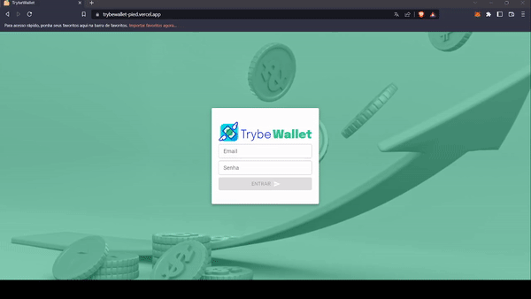
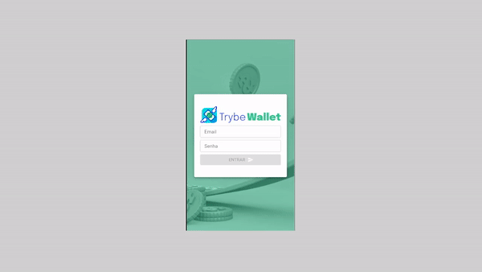

<!-- Olá, Tryber!
Esse é apenas um arquivo inicial para o README do seu projeto.
É essencial que você preencha esse documento por conta própria, ok?
Não deixe de usar nossas dicas de escrita de README de projetos, e deixe sua criatividade brilhar!
:warning: IMPORTANTE: você precisa deixar nítido:
- quais arquivos/pastas foram desenvolvidos por você; 
- quais arquivos/pastas foram desenvolvidos por outra pessoa estudante;
- quais arquivos/pastas foram desenvolvidos pela Trybe.
-->

## 💵TrybeWallet

Este projeto foi desenvolvido durante o curso da Trybe no módulo de Front End.

### Veja o projeto em produção: https://trybewallet-pied.vercel.app/

#### Página de Login (Desktop)

#### Adicionando, editando e excluindo despesas (Desktop)

#### Versão Mobile

## 🎯Objetivo

Desenvolver uma carteira de controle de gastos com conversor de moedas, ao utilizar essa aplicação um usuário pode:

•Realizar login utilizando um email e senha de no mínimo 6 caracteres

•Adicionar, remover e editar um gasto;

•Visualizar uma tabelas com seus gastos;

•Visualizar o total de gastos convertidos para uma moeda de escolha;

## 📝Habilidades avaliadas neste projeto

•Criar um store Redux em aplicações React

•Criar reducers no Redux em aplicações React

•Criar actions no Redux em aplicações React

•Criar dispatchers no Redux em aplicações React

•Conectar Redux aos componentes React

•Criar actions assíncronas na sua aplicação React que faz uso de Redux.

## 🔧Tecnologias utilizadas durante o desenvolvimento

•React;

•Ciclo de vida do React;

•React Router;

•Redux;

•Styled Components;

•Material UI;

